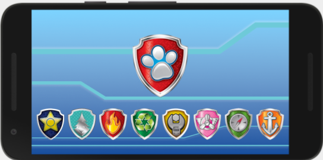
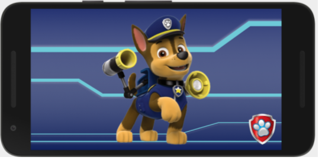

<h1>Pup Pad - Patrulha Canina</h1>

  

Projeto realizado pensando na minha filha, utilizando os personagens do desenho Patrulha Canina. No desenho os cachorrinhos formam uma equipe de resgate e salvamento onde cada um possui uma especialidade, e o personagem principal do desenho (Ryder), líder da equipe utiliza um tablet/celular para selecionar os filhotes que vão atender a uma missão e passar a estratégia de resgate. O App tem o objetivo de simular esse tablet, chamado de <b>Pup Pad</b> que ele utiliza para selecionar os filhotes que irão atender a uma missão. 

 

O App é bem simples, possui uma tela inicial com os escudos que representam cada filhote. Ao clicar em cada escudo a navegação é feita para a tela de cada filhote correspondente, e ao clicar em cima da imagem do filhote o App volta para a página inicial. Exercício desafiador pra mim, foi o primeiro App que desenvolvi desde o inicio, consegui desenvolver bastante a habilidade de buscar a documentação das bibliotecas para resolver os problemas encontrados no percurso, e fiquei bastante satisfeito com  o resultado.

 

 

# Tecnologia e bibliotecas utilizadas

- Mobile
  - JavaScript, React Native, Expo, React-navigation, CSS. 

# Meta
  - Carlos Hiroshi Hayashi - @9caca - carlos.hiroshi.hayashi@gmail.com
  - Distribuído sob a licença [MIT License](https://https://github.com/9caca/AirCnC/blob/master/LICENSE)
