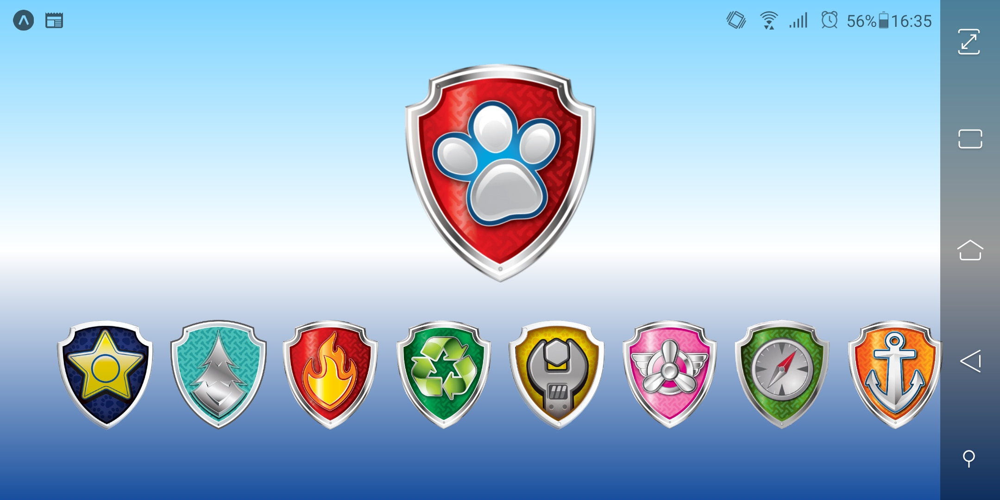
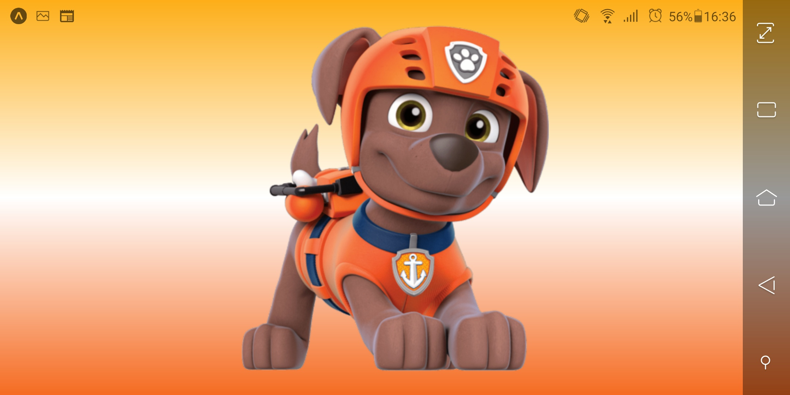

<h1>Pup Pad - Patrulha Canina</h1>

  

Projeto realizado pensando na minha filha, onde o App busca simular o tablet do personagem principal do desenho (Ryder) que ele utiliza para selecionar os filhotes que irão atender a uma missão. 

>Este projeto foi desenvolvido pela @Rocketseat na Semana OminStack 9.0. Durante o curso pude aprender bastante sobre JavaScript, React,
React-Native, Node.js, CleanCode e Boas práticas.

 

 

# Tecnologia e bibliotecas utilizadas

- BackEnd
  - Node.js, Express, Socket.io, MongoDB, Mongoose, Multer, Insomnia.

- FrontEnd
  - ES6, CSS3, React, API Rest, Socket.io-client, Axios.

- Mobile
  - React Native, Expo, Socket.io-client, Axios. 

# Meta
  - Carlos Hiroshi Hayashi - @9caca - carlos.hiroshi.hayashi@gmail.com
  - Distribuído sob a licença [MIT License](https://https://github.com/9caca/AirCnC/blob/master/LICENSE)
